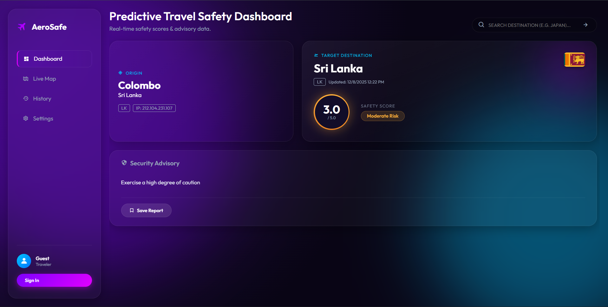

Here is the clean, raw Markdown content for your `README.md` file.

**Instructions:**

1.  Go to your GitHub repository.
2.  Click the **pencil (edit) icon** on your `README.md` file.
3.  **Delete everything** currently in the file.
4.  Copy the code block below and **paste it directly** into the editor.
5.  Commit your changes.

-----

````markdown
# ✈️ AeroSafe - Predictive Travel & Safety Dashboard


**AeroSafe** is a modern, real-time travel intelligence dashboard designed to keep travelers safe. It provides instant safety scores, government travel advisories, and risk assessments for destinations worldwide, wrapped in a stunning "Dreamscape Aurora" glassmorphism interface.



---

## 🚀 Features

* **🌍 Smart Location Detection:** Automatically detects your current "Origin" city and country using IP geolocation.
* **🛡️ Predictive Safety Scoring:** Calculates a real-time risk score (0-5) based on official government advisory keywords.
* **⚡ Instant Advisory Search:** Search any country by name (e.g., "Japan") or ISO code (e.g., "JP") to get live travel warnings.
* **🎨 Dreamscape UI:** A "user-lovable" interface featuring glassmorphism cards, neon gradients, and ambient animations.
* **💾 History & Persistence:** Sign in via Google to save your travel searches to a MongoDB database.
* **📱 Fully Responsive:** Works seamlessly on desktops, tablets, and mobile devices.

---

## 🛠️ Tech Stack

### **Frontend**
* HTML5, CSS3 (Custom Glassmorphism Variables)
* Vanilla JavaScript (ES6+)
* Boxicons (Icons)
* Google Fonts (Outfit)

### **Backend**
* Node.js & Express.js
* MongoDB & Mongoose (Data Persistence)
* Passport.js (Authentication)

### **APIs Used**
* **IP-API:** For origin geolocation.
* **Gov of Canada Travel API:** For real-time advisory text.
* **FlagCDN:** For dynamic country flags.

---

## ⚙️ Prerequisites

Before running the project, ensure you have the following installed:
1. **Node.js** (v14 or higher)
2. **MongoDB** (Running locally or using a MongoDB Atlas connection string)

---

## 📥 Installation & Setup

### 1. Clone the Repository
```bash
git clone [https://github.com/KestroyStephan/Predictive-Travel-Safety-Dashboard.git](https://github.com/KestroyStephan/Predictive-Travel-Safety-Dashboard.git)
cd Predictive-Travel-Safety-Dashboard
````

### 2\. Setup the Backend

Navigate to the root directory (where `server.js` is located).

1.  **Install Dependencies:**

    ```bash
    npm install
    ```

2.  **Create a .env file:**
    Create a file named `.env` in the root folder and add the following keys:

    ```env
    PORT=4000
    MONGODB_URI=mongodb://127.0.0.1:27017/travel_safe
    SESSION_SECRET=your_secret_key_here

    # Optional: Google OAuth Credentials (for Login)
    GOOGLE_CLIENT_ID=your_google_client_id
    GOOGLE_CLIENT_SECRET=your_google_client_secret
    ```

3.  **Start the Server:**

    ```bash
    node server.js
    ```

    *You should see: 🚀 Server running at http://localhost:4000*

### 3\. Setup the Frontend

Navigate to the client folder.

1.  **Go to Client Directory:**

    ```bash
    cd client
    ```

2.  **Start Local Server:**

    ```bash
    npx http-server -p 5500
    ```

3.  **Open in Browser:**
    Go to `http://localhost:5500`

-----

## 📂 Project Structure

```text
Predictive-Travel-Safety-Dashboard/
│
├── client/                 # Frontend Logic
│   ├── index.html          # Main Dashboard
│   ├── history.html        # History Page
│   ├── styles.css          # Dreamscape Aurora Theme
│   └── app.js              # Client-side Logic & API Calls
│
├── models/                 # Mongoose Models
│   └── AdvisoryRecord.js   # Schema for saved reports
│
├── auth.js                 # Passport.js Auth Configuration
├── server.js               # Main Backend Server
├── package.json            # Backend Dependencies
└── README.md               # Project Documentation
```

-----

## 🔮 Future Improvements

  - [ ] Add interactive map visualization (Leaflet/Mapbox).
  - [ ] Implement email alerts for advisory changes.
  - [ ] Add weather data integration.
  - [ ] Add multi-language support.


```

Would you like me to help you set up a `.gitignore` file to make sure your private `.env` keys aren't uploaded to GitHub?
```